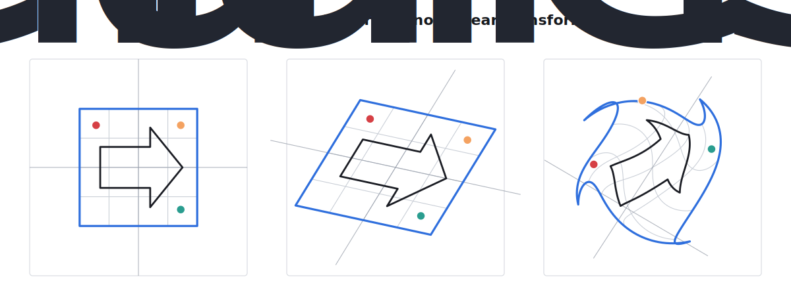

# Transformations of Vector Spaces and Linear Transformations

Let's say we have a vector space $\mathbb{R}^2$. Let's write each element as

$$
v=\begin{pmatrix} x \\ y \end{pmatrix}.
$$

It can be thought of as a vector, or as a point on a 2D plane.

A *transformation* of this space maps every element of this space into another element. In the most general form, we can write it as

$$
T: \mathbb{R}^2 \to \mathbb{R}^2,\qquad
v=\begin{pmatrix} x \\ y \end{pmatrix}
\mapsto
T(v)=\begin{pmatrix} f_1(x, y) \\ f_2(x,y) \end{pmatrix}.
$$

At first glance, one might write each component as a familiar "linear-looking" function

$$
f(x,y)=c+ax+by.
$$

The constant term $c$ is a translation shift. In coordinate geometry this is often called a linear function, but in linear algebra the presence of $c$ makes the transformation *affine*, not linear. A genuinely linear transformation must send the zero vector to the zero vector, so the constant term has to vanish:

$$
f(x,y)=ax+by.
$$

For a *linear* transformation, both component functions $f_1$ and $f_2$ have this form. Equivalently, the transformation can be represented by a matrix:

$$
T(v)=Av,\qquad
A=\begin{pmatrix} a & b \\ c & d \end{pmatrix}.
$$

This is the visual difference: a linear map can rotate, scale, shear, and reflect, but it sends straight grid lines to straight grid lines. A non-linear map can bend the grid itself.

{#fig-transformations width="697px"}

The middle panel in @fig-transformations uses

$$
A=\begin{pmatrix}1.15 & 0.55 \\ -0.25 & 0.9\end{pmatrix}.
$$

The right panel uses the non-linear transformation

$$
\theta(x,y)=0.75(x^2+y^2)+0.25x,
$$

$$
T_{\text{nonlinear}}(x,y)=
\begin{pmatrix}
x\cos\theta(x,y)-y\sin\theta(x,y) \\
x\sin\theta(x,y)+y\cos\theta(x,y)+0.18\sin(\pi x)
\end{pmatrix}.
$$

Since the rotation angle depends on the point $(x,y)$, different parts of the shape rotate by different amounts. That is why straight grid lines become curved.
