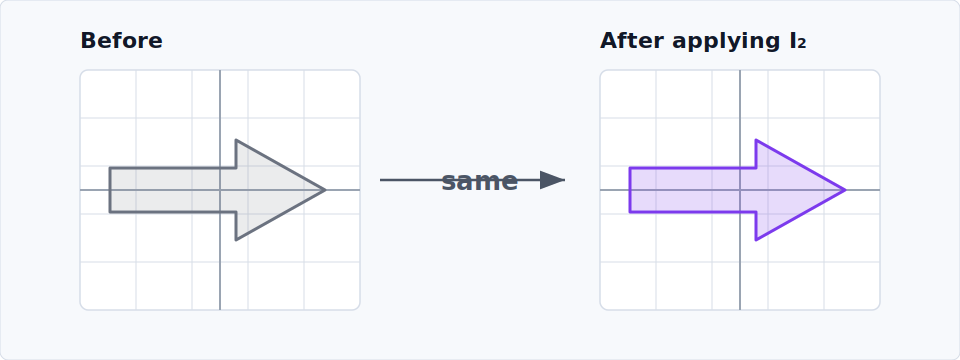

# Linear Transformations in $\mathbb{R}^2$

Check out this interactive [playground](matrix-transform-playground.qmd).

## Identity Matrix

The first useful special case is the identity matrix:

$$
I=
\begin{pmatrix}
1 & 0 \\
0 & 1
\end{pmatrix}.
$$

It is called the identity matrix because it leaves every vector exactly as it was. For an arbitrary vector $v=\begin{pmatrix}x\\y\end{pmatrix}$,

$$
Iv
=
\begin{pmatrix}
1 & 0 \\
0 & 1
\end{pmatrix}
\begin{pmatrix}
x\\y
\end{pmatrix}
=
\begin{pmatrix}
1x+0y\\
0x+1y
\end{pmatrix}
=
\begin{pmatrix}
x\\y
\end{pmatrix}.
$$

Here is the picture:

{fig-alt="Identity transformation leaves a grid and arrow-shaped region unchanged." width="100%"}

## Determinant

For a matrix

$$
A=
\begin{pmatrix}
a & b\\
c & d
\end{pmatrix}.
$$

the columns tell us where the basis vectors go:

$$
Ae_1=
\begin{pmatrix}
a\\c
\end{pmatrix},
\qquad
Ae_2=
\begin{pmatrix}
b\\d
\end{pmatrix}.
$$

So the unit square spanned by $e_1$ and $e_2$ becomes the parallelogram spanned by $Ae_1$ and $Ae_2$.

```{=html}
<div id="determinant-visualization" style="margin: 1rem 0 1.5rem;"></div>
<script>
(() => {
  const host = document.currentScript.previousElementSibling;
  const ns = "http://www.w3.org/2000/svg";
  let svg;
  svg = el("svg", {
    viewBox: "0 0 980 380",
    role: "img",
    "aria-label": "The unit square transforms into a parallelogram whose signed area is the determinant.",
    style: "display:block;width:100%;height:auto;border:1px solid #d6dde8;border-radius:8px;background:#f7f9fc;"
  }, null);

  function el(name, attrs = {}, parent = svg) {
    const node = document.createElementNS(ns, name);
    for (const [key, value] of Object.entries(attrs)) {
      node.setAttribute(key, value);
    }
    if (parent) {
      parent.appendChild(node);
    }
    return node;
  }

  function text(value, x, y, attrs = {}) {
    const node = el("text", {
      x,
      y,
      "font-family": "system-ui, -apple-system, BlinkMacSystemFont, 'Segoe UI', sans-serif",
      ...attrs
    });
    node.textContent = value;
    return node;
  }

  function project(origin, point, scale = 78) {
    return [origin[0] + point[0] * scale, origin[1] - point[1] * scale];
  }

  function line(origin, start, end, attrs = {}) {
    const [x1, y1] = project(origin, start);
    const [x2, y2] = project(origin, end);
    el("line", { x1, y1, x2, y2, ...attrs });
  }

  function polygon(origin, points, attrs = {}) {
    const projected = points.map((point) => project(origin, point).join(",")).join(" ");
    el("polygon", { points: projected, ...attrs });
  }

  function drawGrid(origin) {
    for (let value = -1; value <= 2; value += 0.5) {
      line(origin, [value, -1], [value, 2], { stroke: "#dde3ec", "stroke-width": 1 });
      line(origin, [-1, value], [2, value], { stroke: "#dde3ec", "stroke-width": 1 });
    }
    line(origin, [-1, 0], [2, 0], { stroke: "#9aa4b2", "stroke-width": 2 });
    line(origin, [0, -1], [0, 2], { stroke: "#9aa4b2", "stroke-width": 2 });
  }

  const defs = el("defs");
  const marker = el("marker", {
    id: "det-arrowhead",
    markerWidth: 10,
    markerHeight: 10,
    refX: 8,
    refY: 3,
    orient: "auto"
  }, defs);
  el("path", { d: "M0,0 L0,6 L8,3 z", fill: "#111827" }, marker);

  const left = [210, 270];
  const right = [640, 270];
  const u = [1.25, 0.35];
  const v = [0.45, 1.15];
  const uPlusV = [u[0] + v[0], u[1] + v[1]];

  text("basis vectors", 210, 48, { "text-anchor": "middle", "font-size": 22, "font-weight": 700, fill: "#111827" });
  text("after applying A", 640, 48, { "text-anchor": "middle", "font-size": 22, "font-weight": 700, fill: "#111827" });
  text("A", 486, 190, { "text-anchor": "middle", "font-size": 30, "font-weight": 800, fill: "#111827" });
  el("path", { d: "M400 198 H560", stroke: "#4b5565", "stroke-width": 2.5, fill: "none", "marker-end": "url(#det-arrowhead)" });

  drawGrid(left);
  polygon(left, [[0, 0], [1, 0], [1, 1], [0, 1]], {
    fill: "rgba(107,114,128,0.16)",
    stroke: "#6b7280",
    "stroke-width": 3,
    "stroke-dasharray": "6 5"
  });
  line(left, [0, 0], [1, 0], { stroke: "#0f9f8f", "stroke-width": 5, "marker-end": "url(#det-arrowhead)" });
  line(left, [0, 0], [0, 1], { stroke: "#c45a11", "stroke-width": 5, "marker-end": "url(#det-arrowhead)" });
  text("e1", ...project(left, [1, 0]), { dx: 10, dy: -8, "font-size": 18, "font-weight": 700, fill: "#0f9f8f" });
  text("e2", ...project(left, [0, 1]), { dx: 10, dy: -8, "font-size": 18, "font-weight": 700, fill: "#c45a11" });

  drawGrid(right);
  polygon(right, [[0, 0], u, uPlusV, v], {
    fill: "rgba(124,58,237,0.20)",
    stroke: "#7c3aed",
    "stroke-width": 3.5,
    "stroke-linejoin": "round"
  });
  line(right, [0, 0], u, { stroke: "#0f9f8f", "stroke-width": 5, "marker-end": "url(#det-arrowhead)" });
  line(right, [0, 0], v, { stroke: "#c45a11", "stroke-width": 5, "marker-end": "url(#det-arrowhead)" });
  text("Ae1 = (a, c)", ...project(right, u), { dx: 10, dy: -8, "font-size": 17, "font-weight": 700, fill: "#0f9f8f" });
  text("Ae2 = (b, d)", ...project(right, v), { dx: 10, dy: -8, "font-size": 17, "font-weight": 700, fill: "#c45a11" });
  text("signed area = det A = ad - bc", 640, 348, { "text-anchor": "middle", "font-size": 22, "font-weight": 800, fill: "#111827" });
  host.appendChild(svg);
})();
</script>
```

The determinant

$$
\det A = ad-bc
$$

is the signed area of that parallelogram. The ordinary geometric area is

$$
\left|\det A\right|.
$$

Three useful cases:

- $\det A=0$: area collapses to zero, so the map is not invertible.
- $\det A<0$: orientation is reversed.
- $\det A=1$: signed area is preserved.

Area preservation is weaker than shape preservation. Rotations have determinant $1$, but so do shears

$$
\begin{pmatrix}
1 & k\\
0 & 1
\end{pmatrix}
$$

and reciprocal scalings

$$
\begin{pmatrix}
s & 0\\
0 & 1/s
\end{pmatrix}
\qquad (s\ne 0)
$$

These all belong to

$$
SL(2,\mathbb{R})=\{A\in GL(2,\mathbb{R})\mid \det A=1\}.
$$

Rotations are the stricter determinant-one maps that also preserve lengths and angles:

$$
A^TA=I,
\qquad
\det A=1.
$$

The condition $A^TA=I$ means that dot products are preserved:

$$
(Au)\cdot(Av)
=u^TA^TAv
=u^Tv
=u\cdot v.
$$

So lengths and angles are preserved. Equivalently, the columns of $A$ form an orthonormal basis. In two dimensions, $A^TA=I$ allows rotations and reflections; the extra condition $\det A=1$ rules out reflections.
