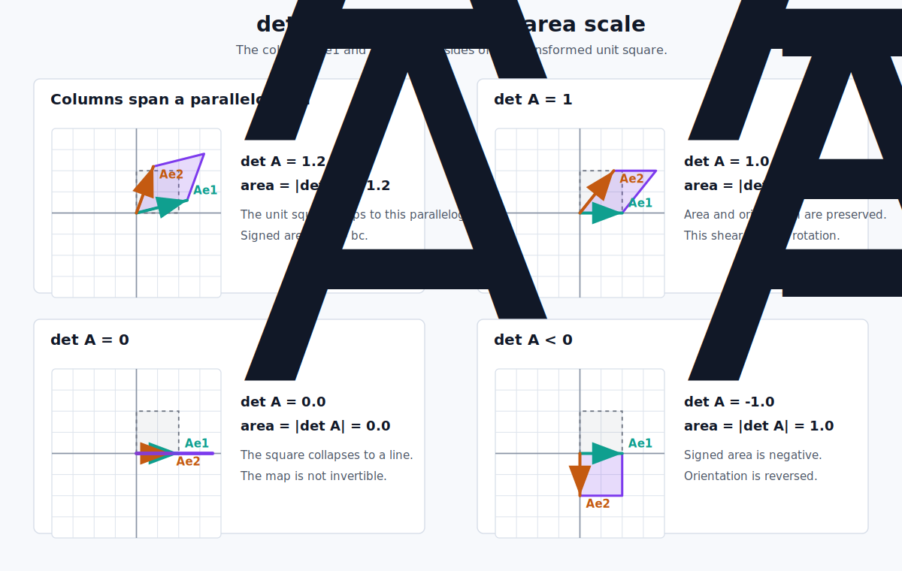

# Linear Transformations in $\mathbb{R}^2$

Check out this interactive [playground](matrix-transform-playground.qmd).

## Identity Matrix

The first useful special case is the identity matrix:

$$
I_2=
\begin{pmatrix}
1 & 0 \\
0 & 1
\end{pmatrix}.
$$

It is called the identity matrix because it leaves every vector exactly as it was. For an arbitrary vector $v=\begin{pmatrix}x\\y\end{pmatrix}$,

$$
I_2v
=
\begin{pmatrix}
1 & 0 \\
0 & 1
\end{pmatrix}
\begin{pmatrix}
x\\y
\end{pmatrix}
=
\begin{pmatrix}
1x+0y\\
0x+1y
\end{pmatrix}
=
\begin{pmatrix}
x\\y
\end{pmatrix}.
$$

Here is the picture:

{fig-alt="Identity transformation leaves a grid and arrow-shaped region unchanged." width="100%"}

## Determinant

Let

$$
A=
\begin{pmatrix}
a & b\\
c & d
\end{pmatrix}.
$$

The first column is where the first basis vector goes, and the second column is where the second basis vector goes:

$$
Ae_1=
\begin{pmatrix}
a\\c
\end{pmatrix},
\qquad
Ae_2=
\begin{pmatrix}
b\\d
\end{pmatrix}.
$$

The unit square has corners $0$, $e_1$, $e_2$, and $e_1+e_2$. After applying $A$, those corners become

$$
0,\qquad
Ae_1,\qquad
Ae_2,\qquad
Ae_1+Ae_2.
$$

So the image of the unit square is the parallelogram spanned by the two column vectors of $A$. The determinant

$$
\det A = ad-bc
$$

is the signed area of this parallelogram. The ordinary geometric area is

$$
\left|\det A\right|.
$$

{fig-alt="The determinant is the signed area of the parallelogram spanned by the transformed basis vectors, with determinant one, zero, and negative examples." width="100%"}

The sign tells us about orientation:

- If $\det A>0$, orientation is preserved.
- If $\det A<0$, orientation is reversed.
- If $\det A=0$, the square collapses to a line or point. The area is zero, so the transformation cannot be inverted.

When $\det A=1$, the transformation preserves signed area. This is not the same thing as preserving lengths or angles. Rotations have determinant $1$, but they are only a small subset of determinant-one transformations.

For example, every shear of the form

$$
\begin{pmatrix}
1 & k\\
0 & 1
\end{pmatrix}
$$

has determinant $1$, and every reciprocal scaling

$$
\begin{pmatrix}
s & 0\\
0 & 1/s
\end{pmatrix}
\qquad (s\ne 0)
$$

also has determinant $1$. These transformations can visibly stretch or shear a shape while keeping its area unchanged.

The determinant-one linear transformations form the group

$$
SL(2,\mathbb{R})=\{A\in GL(2,\mathbb{R})\mid \det A=1\}.
$$

Rotations are the stricter special case where lengths and angles are also preserved:

$$
A^TA=I,
\qquad
\det A=1.
$$
